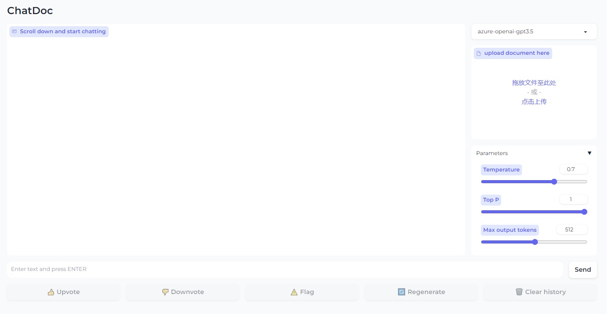
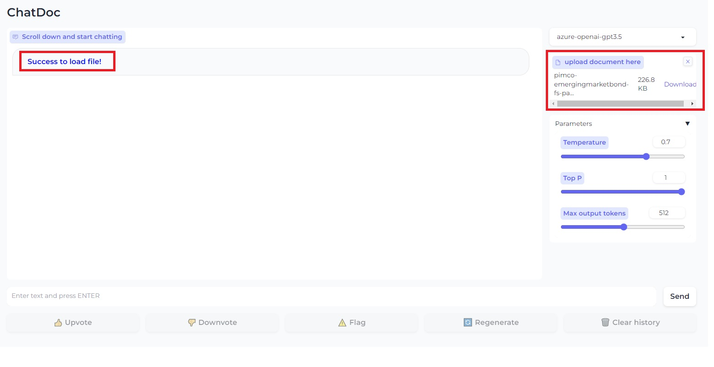
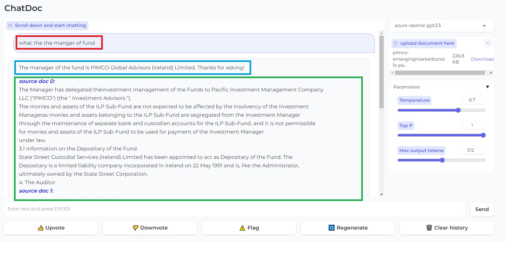

# chatdoc
This repository is for hackthon2023

# run the webui
1. prepare the virtual env
```shell 
conda create -n chatdoc_env python==3.9.16  
conda activate chatdoc_env  
pip install -r requirements.txt    
```


2. run the webui server

```shell  
cd src  
```

```python  
python webui.py  
```



3. upload the pdf and process the pdf



4. ask the question and get the answer  




# server configs
src/configs/config.py


# data
公开的搜索途径就是可以去大资产管理公司的官网搜索fund documentation，比如这个是一个资管机构BNP官网的基金文件：Fund documentation 基金文件 - BNPP AM Hong Kong (bnpparibas-am.com)

1. [pimco-emergingmarketbond-fs.pdf](https://www.insurance.hsbc.com.sg/content/dam/hsbc/insn/documents/funds/ilpfund/pimco/emerging-markets-bond-fund/fund-summary/pimco-emergingmarketbond-fs.pdf)
2. [PIMCO Funds Prospectus July 31, 2023](https://www.pimco.com/handlers/displaydocument.ashx?Id=N5CZucjr91ejcDMwCBYVdT%2B9JYhXYRsYqQeCj0inqtaO%2B4%2B1wq4oRCZRYlfkumG7R%2BH4N6%2BLBfrkXQlo9%2BkgTEPRi1OTHJuzfCWMRFMg7oX3pmkZMzYTLo%2FmjZKLYhXQ8j70DA3%2BbJZfht97Udj180KJgYZEUWbJn8%2BtbLuOuKFU9wdJ7LOuQGyUfTdg2oN2Dm74cmcA5G5Run6uInL8AB95X0yUe8BAzjRU8%2BIGvezyjbXaHcRmaw1BA%2FCkgK8J)